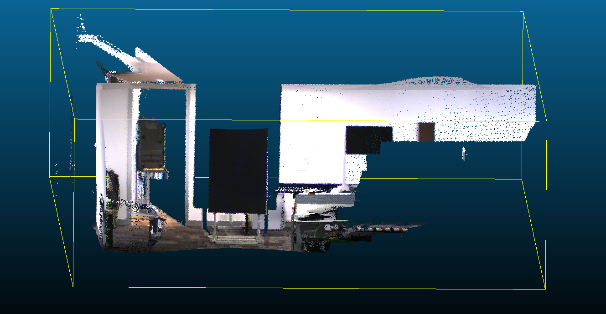
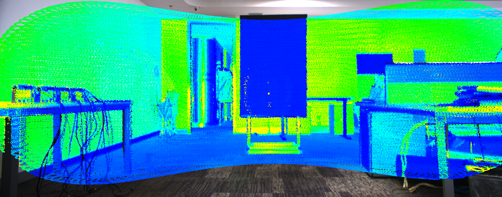

[](https://opensource.org/licenses/MIT)

# 📝 Automatic Targetless Lidar Camera Calibration #
***

Auto-calibration of lidar and camera based on maximization of intensity mutual information.
This is the reimplementation of the paper: [Automatic Targetless Extrinsic Calibration of a 3D Lidar and Camera by Maximizing Mutual Information](http://robots.engin.umich.edu/publications/gpandey-2012a.pdf)

## :tada: TODO
***

- [x] reimplementation of [Automatic Targetless Extrinsic Calibration of a 3D Lidar and Camera by Maximizing Mutual Information](http://robots.engin.umich.edu/publications/gpandey-2012a.pdf)
- [x] test on real lidar, camera data

## 🎛  Dependencies
***
- tested on Ubuntu 20.04
```bash
sudo apt-get install \
    libopencv-dev \
    libpcl-dev \
    rapidjson-dev \
```

## 🔨 How to Build ##
***

```bash
make default -j`nproc`

# build examples
make apps -j`nproc`
```

## :running: How to Run ##
***

- Download livox lidar data together with images from [here](https://terra-1-g.djicdn.com/65c028cd298f4669a7f0e40e50ba1131/Download/update/data.zip)(If you are interested, you can search for more about low-cost [livox lidars](https://github.com/Livox-SDK/livox_camera_lidar_calibration)).
- Extract the sample data, and create two files **images.txt** and **point_clouds.txt** that store absolute paths to image, pcd data file respectively. One line for one file.
- Create camera info with camera instrinsic matrix, a sample is provided [here](./data/samples/camera_info.json)
- Create initial guess of transformation info from lidar to camera, in the form of translation(tx, ty, tz), rotation(roll, pitch, yaw); a sample is provided [here](./data/samples/initial_guess.json)
- Fill absolute paths to the above files in [calibration_handler_param.json](./data/samples/calibration_handler_param.json)
- Run (after make apps)
```
    ./build/examples/sensors_calib_app ./data/samples/calibration_handler_param.json
```

After the optimization finishes, the final transformation info will be printed out.

Also the projected (image to) pointclouds; (pointcloud to) images will be saved. Check cloud*.pcd and img*.png files.

- Here is the sample results:

projected cloud:



projected image:



## :gem: References ##
***
- [Automatic Targetless Extrinsic Calibration of a 3D Lidar and Camera by Maximizing Mutual Information, AAAI 2012](http://robots.engin.umich.edu/publications/gpandey-2012a.pdf)
- [Automatic Calibration of Lidar and Camera Images using Normalized Mutual Information, ICRA 2013](http://www-personal.acfr.usyd.edu.au/jnieto/Publications_files/TaylorICRA2013.pdf)
- [Accurate Extrinsic Calibration between Monocular Camera and Sparse 3D Lidar Points without Markers, IV 2017](https://ieeexplore.ieee.org/document/7995755)
